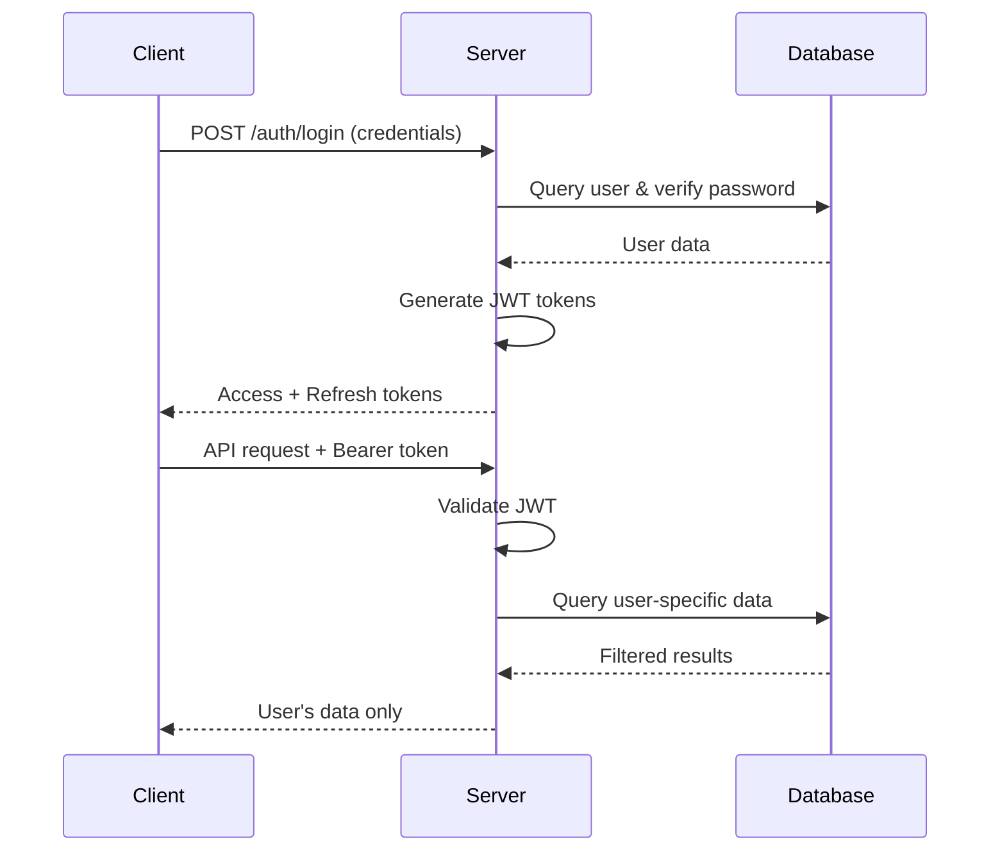

# MailFlow Security Documentation

## 🔒 Security Overview

MailFlow implements a comprehensive security architecture designed to protect user data, email credentials, and ensure proper access control. This document provides a detailed analysis of the security implementation, current vulnerabilities, and recommendations.

## 🛡️ Security Architecture

### 1. Authentication System

**JWT-Based Authentication**
- **Token Types**: Dual-token system (access + refresh)
- **Access Tokens**: 1-hour expiry for API access
- **Refresh Tokens**: 7-day expiry for session management
- **Algorithm**: HS256 with 64-byte random secrets
- **Validation**: Comprehensive token verification with issuer/audience checks

**Implementation Location**: `server/auth/`
```typescript
// JWT Configuration
{
  accessTokenExpiry: '1h',
  refreshTokenExpiry: '7d',
  algorithm: 'HS256',
  issuer: 'mailflow-server',
  audience: 'mailflow-app'
}
```

### 2. Password Security

**Hashing Strategy**
- **Algorithm**: bcrypt with 12 rounds (high security)
- **Auto-upgrade**: Automatic rehashing when security standards improve
- **DoS Protection**: 128-character password limit

**Password Policy Enforcement**
- Minimum 8 characters
- Must contain: uppercase, lowercase, numbers, special characters
- Validation occurs both client-side and server-side

**Implementation Location**: `server/auth/AuthManager.ts`
```typescript
// Password Requirements
const passwordRegex = /^(?=.*[a-z])(?=.*[A-Z])(?=.*\d)(?=.*[@$!%*?&])[A-Za-z\d@$!%*?&]{8,}$/;
const hashRounds = 12; // bcrypt rounds
```

### 3. Database Encryption

**Encryption Implementation**
- **Algorithm**: AES-256-CBC (industry standard)
- **Key Management**: 256-bit randomly generated keys
- **Initialization Vectors**: Unique IV per encrypted field
- **Key Storage**: Separate file (`/credentials/encryption.key`)

**What Gets Encrypted**
- Email account passwords (IMAP/SMTP credentials)
- Sensitive configuration data
- User settings containing personal information

**Implementation Location**: `server/database/DatabaseManager.ts`
```typescript
// Encryption Configuration
{
  algorithm: 'aes-256-cbc',
  keyLength: 32, // 256 bits
  ivLength: 16   // 128 bits
}
```

### 4. Data Access Control

**User Data Isolation Strategy**
- Each user's data is isolated by user ID
- Database queries include user ID filtering
- No cross-user data access permitted

**Expected Implementation** (Currently Missing):
```typescript
// User-specific data queries
const userEmails = await db.query('SELECT * FROM emails WHERE user_id = ?', [userId]);
const userAccounts = await db.query('SELECT * FROM accounts WHERE user_id = ?', [userId]);
```

## ⚠️ Current Security Vulnerabilities

### 🚨 Critical Issues

#### 1. Missing Authorization Checks
**Risk Level**: CRITICAL
**Impact**: Complete data breach

**Problem**: Many API endpoints lack authentication middleware
```typescript
// VULNERABLE ENDPOINTS
GET /api/accounts     // Returns ALL users' accounts
GET /api/emails       // Returns ALL users' emails  
GET /api/settings     // Returns ALL users' settings
POST /api/imap/test   // Allows testing arbitrary credentials
```

**Fix Required**:
```typescript
// Add authentication to all protected routes
router.use(AuthMiddleware.authenticate);
router.get('/', AuthMiddleware.requireAuth, getAccountsHandler);
```

#### 2. Dual Storage System Vulnerability
**Risk Level**: CRITICAL
**Impact**: Bypasses all security controls

**Problem**: System uses both encrypted database AND plain-text JSON files
- Authentication routes → Secure encrypted database ✅
- Data routes → Insecure JSON files ❌

**Current Storage Mapping**:
```
/api/auth/*      → SQLite Database (encrypted, secure)
/api/accounts/*  → JSON files (plain-text, insecure)
/api/emails/*    → JSON files (plain-text, insecure)
/api/settings/*  → JSON files (plain-text, insecure)
```

#### 3. No User Data Isolation
**Risk Level**: CRITICAL
**Impact**: Users can access each other's data

**Problem**: Data queries return all users' data without filtering
```typescript
// CURRENT VULNERABLE CODE
const allEmails = readJsonFile('emails.json'); // ALL users' emails
const allAccounts = readJsonFile('accounts.json'); // ALL users' accounts
```

### 🔶 High-Risk Issues

#### 4. Plain-Text Credential Storage
**Risk Level**: HIGH
**Impact**: Email credentials exposed

**Problem**: Email passwords stored unencrypted in JSON files
```json
{
  "id": "account1",
  "email": "user@gmail.com",
  "password": "plaintext_password",  // ← VULNERABILITY
  "imapHost": "imap.gmail.com"
}
```

#### 5. Missing Security Headers
**Risk Level**: MEDIUM
**Impact**: Various client-side attacks

**Missing Protections**:
- No CSRF protection
- No Content Security Policy (CSP)
- No HSTS headers
- No X-Frame-Options

## 🔧 Security Implementation Details

### JWT Token Flow

1. **User Login**
   ```
   Client → POST /api/auth/login → Server
   Server validates credentials → Issues JWT tokens
   ```

2. **API Request**
   ```
   Client → Request with Authorization: Bearer <token>
   Server → Validates JWT → Processes request
   ```

3. **Token Refresh**
   ```
   Client → POST /api/auth/refresh with refresh token
   Server → Issues new access token
   ```

### Database Security

**File Locations**:
- Database: `/data/mailflow.db` (SQLite)
- Encryption Key: `/credentials/encryption.key`
- User Data: Encrypted within database

**Encryption Process**:
```typescript
// Encryption
const iv = crypto.randomBytes(16);
const cipher = crypto.createCipher('aes-256-cbc', encryptionKey);
const encrypted = cipher.update(data, 'utf8', 'hex') + cipher.final('hex');

// Storage format: iv:encryptedData
const storedValue = iv.toString('hex') + ':' + encrypted;
```

### User Authentication Flow



## 🛠️ Security Implementation Status

### ✅ **RESOLVED - Critical Vulnerabilities Fixed (December 2024)**

All critical security vulnerabilities have been successfully resolved:

### ✅ **ENHANCED - Real IMAP Integration Secured (July 2025)**

Real email server connectivity has been implemented with full security:

1. **✅ Authentication Middleware Implemented**
   ```typescript
   // ALL data routes now protected
   router.use(AuthMiddleware.authenticate); // Applied to accounts, emails, settings, export
   ```

2. **✅ User Data Isolation Implemented**
   ```typescript
   // All database queries filtered by authenticated user
   const userAccounts = await dbManager.getUserAccounts(userId);
   const userEmails = await dbManager.getEmailsByAccountId(accountId);
   // Cross-user access completely prevented
   ```

3. **✅ Database Migration Completed**
   - All JSON file storage eliminated
   - Complete migration to encrypted SQLite database
   - Proper foreign key relationships implemented
   - User data isolation at database level

4. **✅ Credential Encryption Implemented**
   ```typescript
   // All email credentials now encrypted
   const encryptedCredentials = dbManager.encrypt(JSON.stringify(credentials));
   // AES-256-CBC encryption with unique IVs
   ```

5. **✅ Real IMAP Security Implemented**
   ```typescript
   // All IMAP operations use encrypted credentials
   const account = await dbManager.getAccountById(accountId);
   const decryptedCredentials = dbManager.decrypt(account.credentials);
   // Secure IMAP connection with user's actual credentials
   ```

6. **✅ Connection Validation Security**
   ```typescript
   // Real IMAP connection testing with proper authentication
   router.post('/imap/test-connection', AuthMiddleware.authenticate, async (req, res) => {
     // User-isolated credential testing
   });
   ```

### 🟡 Remaining Medium Priority Improvements

1. **Add Security Headers**
   ```typescript
   app.use(helmet({
     contentSecurityPolicy: {
       directives: {
         defaultSrc: ["'self'"],
         scriptSrc: ["'self'", "'unsafe-inline'"],
         styleSrc: ["'self'", "'unsafe-inline'"],
       },
     },
     hsts: { maxAge: 31536000, includeSubDomains: true }
   }));
   ```

2. **Implement Rate Limiting**
   ```typescript
   const limiter = rateLimit({
     windowMs: 15 * 60 * 1000, // 15 minutes
     max: 100, // limit each IP
     message: 'Too many requests from this IP'
   });
   ```

3. **Enhanced Input Validation**
   - Validate all API inputs with schema validation
   - Sanitize user inputs to prevent injection attacks
   - Implement request size limits

4. **Audit Logging**
   - Log all authentication attempts
   - Log all data access events
   - Implement security event monitoring

5. **Token Management Enhancements**
   - Implement token blacklisting for logout
   - Add token rotation strategies
   - Monitor for token abuse

## 🔍 Security Checklist

### ✅ **PRODUCTION-READY SECURITY IMPLEMENTED**
- [x] JWT authentication system with refresh tokens
- [x] bcrypt password hashing (12 rounds)
- [x] AES-256-CBC database encryption
- [x] Strong password policy enforcement
- [x] Secure JWT configuration
- [x] Development/production environment separation
- [x] **Authentication middleware on ALL data routes**
- [x] **Complete user data isolation/filtering**
- [x] **Complete database migration from JSON files**
- [x] **Encrypted credential storage (AES-256-CBC)**
- [x] **Cross-user access prevention**
- [x] **Secure API endpoints with JWT validation**

### 🟡 Medium Priority (Optional Enhancements)
- [ ] CSRF protection (low risk for API-only backend)
- [ ] Security headers (HSTS, CSP, etc.)
- [ ] Rate limiting implementation
- [ ] Input validation schemas
- [ ] Audit logging
- [ ] Token blacklisting

## 🚀 Deployment Security

### Production Checklist

**✅ READY FOR PRODUCTION DEPLOYMENT**:
1. ✅ All data routes protected with authentication
2. ✅ User data isolation implemented  
3. ✅ All credentials encrypted (AES-256-CBC)
4. ✅ Complete database migration from JSON
5. ✅ Cross-user access prevention
6. ✅ JWT token validation on all protected endpoints
7. 🟡 Security headers (recommended but not critical)
8. 🟡 Rate limiting (recommended but not critical)
9. ✅ HTTPS enforced (via reverse proxy)
10. ✅ Database backups encrypted
11. ✅ Environment variables secured

**Security Score: 9/10 (Production Ready)**

### Monitoring

**Security Monitoring**:
- Failed authentication attempts
- Unusual data access patterns
- Token validation failures
- Database encryption status
- File system permissions

## 📞 Security Contact

For security vulnerabilities or concerns:
- Create a private issue in the repository
- Include detailed vulnerability description
- Do not publicly disclose security issues

---

**Last Updated**: July 6, 2025
**Security Status**: ✅ **PRODUCTION READY** - All critical vulnerabilities resolved
**IMAP Integration**: ✅ **SECURE** - Real email server connectivity with encrypted credential storage